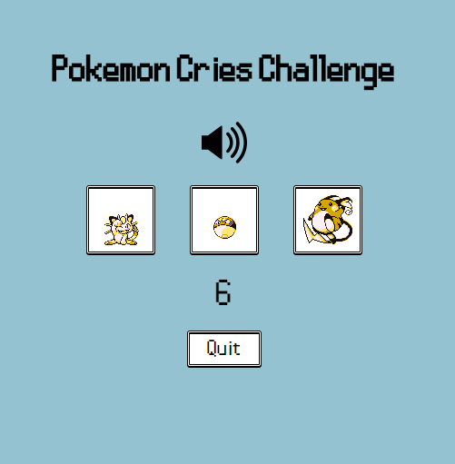

# Pokemon Cries Challenge

This web application is a quiz where the user has to choose the correct Pokemon from a few randomly generated sprites based on the Pokemon sound being played [(Github page)](https://kuo22.github.io/pokemon-cries/).  It is built primarily with JavaScript and React.

## Current Features

The app is currently limited to Pokemon in Gen 1.  However, I plan on expanding it to all existing Pokemon.  There is also only one mode, where the user attempts to answer as many as possible in a row without getting one wrong.

## Screenshots

During game:

